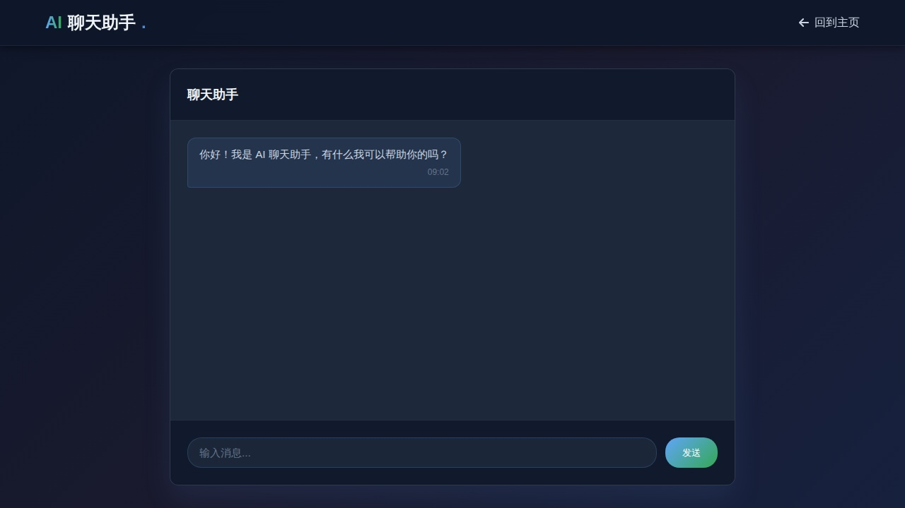
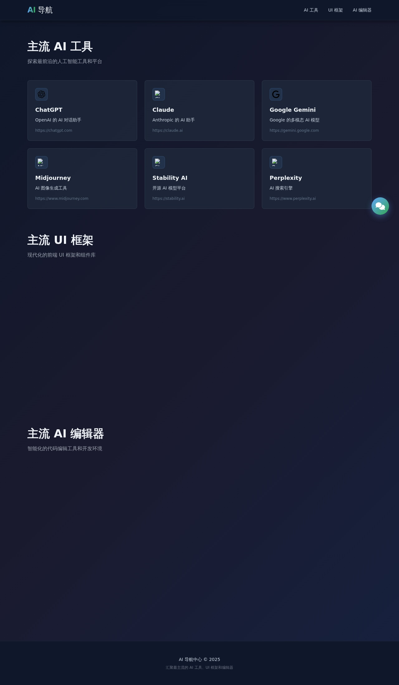
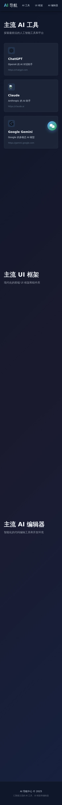
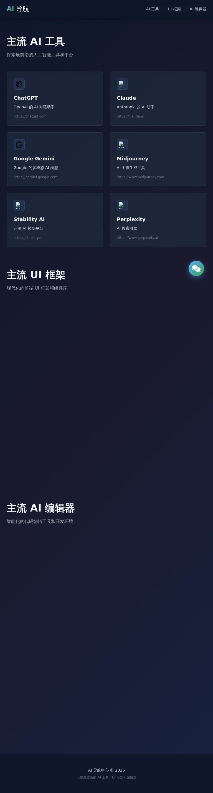

# 🤖 AI Navigation Center

一个现代化的 AI 导航中心，汇聚最主流的 AI 工具、UI 框架和 AI 编辑器。

[English](./README_EN.md) | 中文

## ✨ 功能特性

### 🎯 核心功能

- **🔗 导航中心**: 集合主流 AI 工具、UI 框架和 AI 编辑器的快速访问
- **💬 聊天助手**: 交互式 AI 对话界面
- **📱 响应式设计**: 完美支持桌面、平板和手机设备
- **🌙 暗色主题**: 现代化的深色主题设计，护眼舒适

### 🎨 设计特色

- 采用 Tailwind CSS 构建，高效的原子化 CSS 框架
- Google 风格的简洁 UI 设计
- Animate.css 和 AOS.js 的流畅动画效果
- 自定义字体图标和favicon动态加载

### ⚡ 性能优化

- Service Worker 离线缓存支持
- 智能资源预加载和缓存策略
- 最小化 JavaScript 包体积

## 📋 项目结构

```
htmls/
├── index.html              # 主导航页面
├── chat.html               # 聊天助手页面
├── service-worker.js       # Service Worker 缓存策略
├── package.json            # 项目依赖配置
├── playwright.config.js    # Playwright 测试配置
├── tests/
│   └── screenshots.spec.js # 自动截图测试
├── scripts/
│   └── update-readme.js    # README 自动更新脚本
├── .github/
│   └── workflows/
│       └── screenshot.yml  # GitHub Actions 工作流
└── screenshots/            # 自动生成的截图目录
```

## 🚀 快速开始

### 本地开发

1. **克隆项目**

```bash
git clone <repository-url>
cd htmls
```

2. **安装依赖**

```bash
npm install
```

3. **本地预览**

```bash
# 直接用浏览器打开 index.html 文件
# 或使用本地服务器
python -m http.server 8000
```

### 运行测试

```bash
# 运行 Playwright 测试
npm test

# 调试模式
npm run test:debug

# UI 模式查看测试
npm run test:ui

# 有头浏览器模式
npm run test:headed

# 自动更新 README 截图
npm run screenshot
```

## 📸 Page Screenshots

<!-- PLAYWRIGHT_SCREENSHOTS_START -->

## 📸 Page Screenshots

### 🏠 Index Page (Main Navigation)

The main navigation center showcasing AI tools, UI frameworks, and AI editors.

#### Index Full.Jpg


_Captured with Playwright on: 2025-12-22_

### 💬 Chat Page (Conversation Interface)

The AI chat assistant interface for interactive conversations.

#### Chat Full.Jpg



_Captured with Playwright on: 2025-12-22_

### 📱 Responsive Design

Screenshots showing the responsive design across different device sizes.

#### Responsive Desktop.Jpg



_Captured with Playwright on: 2025-12-22_

#### Responsive Mobile.Jpg



_Captured with Playwright on: 2025-12-22_

#### Responsive Tablet.Jpg



_Captured with Playwright on: 2025-12-22_

<!-- PLAYWRIGHT_SCREENSHOTS_END -->

## 🛠 技术栈

### 前端框架

- **React 18**: 用户界面构建
- **Tailwind CSS**: 样式和响应式设计
- **Font Awesome 6**: 图标库
- **Animate.css**: CSS 动画库
- **AOS.js**: 滚动动画库

### 开发工具

- **Playwright**: 自动化测试和截图
- **Node.js 18+**: 运行环境
- **GitHub Actions**: CI/CD 自动化

### 浏览器支持

- Chrome/Chromium (最新版)
- Firefox (最新版)
- Safari (最新版)
- Edge (最新版)

## 📱 页面介绍

### 🏠 主导航页面 (index.html)

主页展示了三个主要部分：

1. **主流 AI 工具**
   - ChatGPT, Claude, Google Gemini, Midjourney, Stability AI, Perplexity

2. **主流 UI 框架**
   - Tailwind CSS, Bootstrap, Material-UI, Ant Design, Chakra UI, Element Plus

3. **主流 AI 编辑器**
   - Trae, CodeBuddy, Qorder, VS Code, GitHub Copilot, Cursor

### 💬 聊天助手页面 (chat.html)

提供实时的 AI 对话交互体验：

- 流式文本输出
- 消息历史记录
- 右键菜单快捷选项
- 自动滚动到最新消息

## 🔄 GitHub Actions 自动化

本项目使用 GitHub Actions 自动运行 Playwright 测试并更新 README：

**触发条件：**

- ✅ 每周一早上 8 点 (UTC) 自动运行
- ✅ 手动触发 (Manual dispatch)
- ✅ Push 到 main 分支时

**自动化流程：**

1. 检出最新代码
2. 安装依赖和 Playwright 浏览器
3. 运行截图测试
4. 自动更新 README.md
5. 提交并推送更改

## 🎯 特性展示

### 动画和交互

- 页面加载动画
- 卡片悬停效果
- 消息滑入动画
- 输入框焦点效果
- 按钮按压反馈

### 缓存策略

- **核心资源**: 预缓存，首次加载优先
- **CDN 资源**: 网络优先，失败回退缓存
- **运行时资源**: 网络优先策略

## 📝 配置说明

### Playwright 配置 (playwright.config.js)

- **浏览器**: Chromium
- **截图质量**: 95%
- **视口尺寸**: 1280x720 (默认)
- **报告**: HTML 报告

### 截图测试覆盖

- ✅ 主页完整页面截图
- ✅ 主页可见区域截图
- ✅ 聊天页面交互截图
- ✅ 响应式设计截图 (桌面、平板、手机)
- ✅ 导航链接验证

## 🔗 快速链接

- [主导航页面](./index.html)
- [聊天助手](./chat.html)
- [GitHub 仓库](https://github.com)
- [提交问题](https://github.com/issues)

## 📄 文件说明

| 文件                        | 说明                |
| --------------------------- | ------------------- |
| `index.html`                | 主导航页面          |
| `chat.html`                 | 聊天助手页面        |
| `service-worker.js`         | 离线缓存和性能优化  |
| `package.json`              | 项目依赖和脚本      |
| `playwright.config.js`      | Playwright 测试配置 |
| `tests/screenshots.spec.js` | 自动化测试脚本      |
| `scripts/update-readme.js`  | README 自动更新脚本 |

## 🤝 贡献指南

欢迎提交 Pull Request 或 Issue！

1. Fork 本仓库
2. 创建特性分支 (`git checkout -b feature/AmazingFeature`)
3. 提交更改 (`git commit -m 'Add some AmazingFeature'`)
4. 推送到分支 (`git push origin feature/AmazingFeature`)
5. 开启 Pull Request

## 📄 开源协议

本项目采用 MIT 协议，详见 [LICENSE](./LICENSE) 文件。

## 👨‍💻 作者

- **创建者**: [@fromsko](https://github.com/fromsko)

## 🙏 致谢

感谢以下开源项目的支持：

- [React](https://react.dev)
- [Tailwind CSS](https://tailwindcss.com)
- [Playwright](https://playwright.dev)
- [Font Awesome](https://fontawesome.com)

## 📞 联系方式

如有任何问题或建议，欢迎通过以下方式联系：

- 📧 Email: [hnkong666@gmail.com]

---

**最后更新**: 2025-12-22
**版本**: 1.0.0  
**状态**: ✅ 活跃维护中
